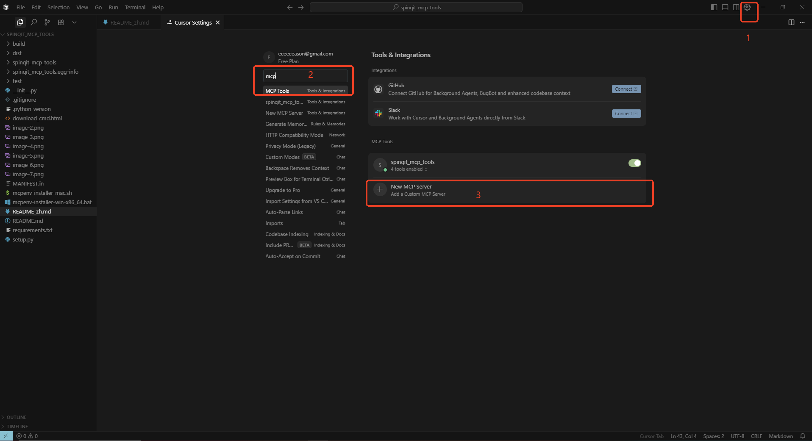

# spinqit_mcp_tools 安装指南

<div align="right">
  <a href="README_zh.md">中文</a> | 
  <a href="README.md">English</a>
</div>
本项目基于mcp-server来支持ai大模型高效调用spinq的量子计算硬件资源。

提供适用于 **Windows** 和 **macOS** 的 `spinqit_mcp_tools` 一键安装脚本。这些脚本会自动检查 Python 环境（需 3.10 或更高版本）并安装所需的 `spinqit_mcp_tools` 依赖包。如果系统中没有合适的 Python 环境，脚本会尝试使用 **Conda** 创建环境，或引导用户手动安装 Python。

## 目录
- [前置条件](#前置条件)
- [自行安装](#自行安装)
- [脚本安装步骤](#脚本安装步骤)
  - [Windows](#windows)
  - [macOS](#macos)
  - [故障排除](#故障排除)
- [cursor测试](#cursor测试)
- [vscode-cline测试](#vscode-cline测试)
- [许可证](#许可证)

## 前置条件

在运行安装脚本之前，请确保满足以下条件：
- **Python 3.10 或更高版本**：`spinqit_mcp_tools` 要求 Python 3.10 或以上版本。
- **Conda（可选）**：如果系统中没有 Python 3.10，脚本可使用 Anaconda 创建环境。请从 [Anaconda](https://www.anaconda.com/download)下载。
- **网络连接**：需要联网以通过 `pip` 下载 `spinqit_mcp_tools` 依赖包。
- **macOS 终端权限**：确保终端支持 `bash`。

## 自行安装

如果您不想使用脚本安装，可以手动安装 `spinqit_mcp_tools`。请按照以下步骤操作，区别仅在于脚本安装会在最终告诉你所在的python路径和启动程序的完整命令方便新手配置：

1. **安装 Python 3.10 或更高版本**：
    - 从 [Python 官网](https://www.python.org/downloads/) 下载并安装 Python 3.10 或更高版本。或者使用 Anaconda 安装 Python。
2. **安装 `spinqit_mcp_tools`**：
    - 打开终端或命令提示符，运行以下命令：
      ```bash
      pip install spinqit_mcp_tools
      ``` 
3. **测试安装成功**：
    - 在终端或命令提示符中运行以下命令，检查是否能成功执行：
      ```bash
      python -m spinqit_mcp_tools.qasm_submitter
      ```
    - 如果看到"FastMCP initialized successfully ,Tool registered"信息，则表示安装成功。
4. **配置 MCP 服务器**：
    - python获取
      - 如果系统中有多个python版本需要指定python路径配置
      - 执行获取路径的配置：python -c "import sys; print(sys.executable)"
      - 得到C:\Users\ylin\.conda\envs\mcp-server-py310\python.exe ，注意在编辑器的配置文件中json需要转义路径层级符号\ -> \\ ，因此输入配置的路径最终为C:\\Users\\ylin\\.conda\\envs\\mcp-server-py310\\python.exe
    - 确认您已在 [SpinQ Cloud](https://cloud.spinq.cn) 注册账号，在本机配置了您的公钥并绑定到[cloud.spinq.cn/userInfo](https://cloud.spinq.cn/userInfo)用户中心，填写PRIVATEKEYPATH和SPINQCLOUDUSERNAME到下方env环境中。
    - 不同的编辑器中如cursor的设置中搜索MCP：
      ```json
      {
        "mcpServers": {
          "spinqit_mcp_tools": {
            "disabled": false,
            "timeout": 60,
            "transportType": "stdio",
            "command": "C:\\Users\\ylin\\.conda\\envs\\mcp-server-py310\\python.exe",
            "args": [
              "-m",
              "spinqit_mcp_tools.qasm_submitter"
            ],
            "env": {
              "PRIVATEKEYPATH": "C:\\Users\\ylin\\.ssh\\id_rsa",
              "SPINQCLOUDUSERNAME": "a492760446"
            }
          }
        }
      }
      ```
5. **具体使用**
    - [cursor测试](#cursor测试)
    - [vscode-cline测试](#vscode-cline测试)

   
## 脚本安装步骤
适用于对环境不熟悉的新手，会在安装成功后输出完整的配置
### Windows

1. **下载脚本**
   - 从以下链接下载 `mcpenv-installer-win-x86_64.bat` 脚本：
     <a href="https://static-cdn.spinq.cn/mcp_server_cmd/download_cmd.html?win">下载 Windows 安装脚本</a>

2. **运行脚本**
   - 双击mcpenv-installer-win-x86_64.bat，运行安装

3. **运行结果**
   - 输出成功提示与完整的mcp_server配置项，记录并配置到所需要的编辑器（如cursor）中
   - 


### macOS

1. **下载脚本**
   - 从以下链接下载 `mcpenv-installer-mac.sh` 脚本：
     <a href="https://static-cdn.spinq.cn/mcp_server_cmd/download_cmd.html?mac">下载 macOS 安装脚本</a>


2. **运行脚本**
   - 执行脚本：
     ```bash
     sudo bash ./mcpenv-installer-mac.sh
     ```

3. **运行结果**
   - 输出成功提示与完整的mcp_server配置项，记录并配置到所需要的编辑器（如cursor）中
   - 


### cursor测试 
- 打开配置
  
- 配置方式
  

- 配置项
  ```
  {
    "mcpServers": {
      "qasm-submitter": {
        "type": "stdio",
        "command": "C:\\Users\\ylin\\.conda\\envs\\mcp-server-py310\\python.exe",
        "args": [
          "-m",
          "spinqit_mcp_tools.qasm_submitter"
        ],
        "env": {
          "PRIVATEKEYPATH":"C:\\Users\\ylin\\.ssh\\id_rsa",
          "SPINQCLOUDUSERNAME":"a492760446"
        }
      }
    }
  }
  ```
- 配置成功后，可以进行提问：“创建并提交一个3比特贝尔态量子线路qasm到云平台，并查看结果
  - 结果
    

### vscode cline测试情况 
- vscode cline插件
  - 配置项：
    ```
    {
      "mcpServers": {
        "qasm-submitter": {
          "disabled": false,
          "timeout": 60,
          "transportType": "stdio", 
          "command": "C:\\Users\\ylin\\.conda\\envs\\mcp-server-py310\\python.exe",
          "args": [
            "-m",
            "spinqit_mcp_tools.qasm_submitter"
          ],
          "env": {
            "PRIVATEKEYPATH": "C:\\Users\\ylin\\.ssh\\id_rsa",
            "SPINQCLOUDUSERNAME": "a492760446"
          }
        }
      }
    }
    ```
  - 配置方式
   
  - 结果
   


### 故障排除

- **未找到 Python 或版本低于 3.10**：
  - 从 [Python 官网](https://www.python.org/downloads/) 下载并安装 Python 3.10，确保添加到 PATH。
  - 安装完成后重新运行脚本。
- **Conda 未被识别**：
  - 在没有python 3.10以上版本时确保已安装 Anaconda，并将其添加到 PATH。
- **pip 安装失败**：
  - 检查网络连接是否正常。
- **Conda 环境创建失败**：
  - 检查 Conda 安装是否完整，是否正在被使用，或从 [Anaconda 官网](https://www.anaconda.com/download) 重新安装。
  - 检查是否内存不足，存储空间不足等导致异常

## 许可证

本项目采用 MIT 许可证，详情请见 [LICENSE](LICENSE) 文件。
